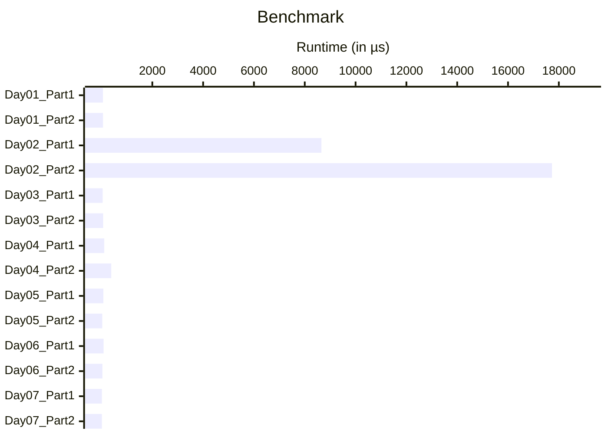

# Benchmark results

<table>
<thead>
<tr><th>Day</th><th colspan="2" align="center">Part 1</th><th colspan="2" align="center">Part 2</th></tr>
<tr><th></th><th>Mean</th><th>std dev</th><th>Mean</th><th>std dev</th></tr>
</thead>
<tbody>
<tr><td>01</td> <td>55.111 µs</td><td>± 2.3999 µs</td> <td>58.647 µs</td><td>± 1.2556 µs</td></tr>
<tr><td>02</td> <td>8.6565 ms</td><td>± 47.496 µs</td> <td>17.731 ms</td><td>± 62.493 µs</td></tr>
<tr><td>03</td> <td>45.403 µs</td><td>± 258.49 ns</td> <td>65.095 µs</td><td>± 459.18 ns</td></tr>
<tr><td>04</td> <td>106.19 µs</td><td>± 2.2667 µs</td> <td>383.03 µs</td><td>± 3.0953 µs</td></tr>
<tr><td>05</td> <td>73.597 µs</td><td>± 1.2363 µs</td> <td>29.584 µs</td><td>± 609.84 ns</td></tr>
<tr><td>06</td> <td>82.791 µs</td><td>± 1.0316 µs</td> <td>36.391 µs</td><td>± 1.1996 µs</td></tr>
<tr><td>07</td> <td>16.043 µs</td><td>± 405.56 ns</td> <td>15.697 µs</td><td>± 408.42 ns</td></tr>
</tbody>
</table>